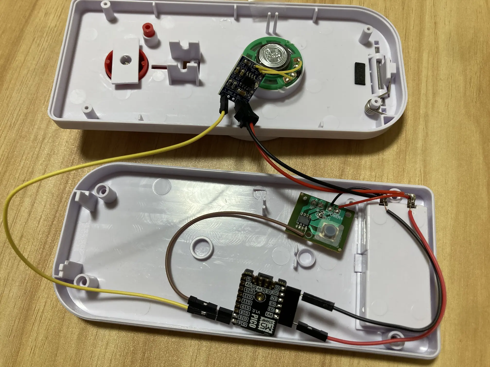

# 配線例

## 使用したパーツ

- 製造元がよくわからないが色々なところで販売されている謎のピンポンブザー
  - 単4電池2本
  - 音出し部は実測で8Ωスピーカーとして扱う
  - 音出し部は、元々ブザー基板につながっていた部分を切り離してアンプへ接続する
  - ブザー基板の右下のピンは、実測で押下検出に使えそうだったためPicoへ接続する
- M5Stamp Pico
- 8002A系アンプモジュール

## 配線

| 接続元 | 接続先 |
| --- | --- |
| ピンポンブザー本体の電池 `+` | Pico `3V3` |
| ピンポンブザー本体の電池 `-` | Pico `GND` |
| ピンポンブザー本体の電池 `+` | アンプ `VCC` |
| ピンポンブザー本体の電池 `-` | アンプ `GND` |
| Pico `GND` | アンプ `GND` |
| Pico `G26` | アンプ `IN` |
| ピンポンブザー基板の信号線 | Pico `G36` |
| ピンポンブザーの音出し部 | アンプ `OUT+` / `OUT-` |
